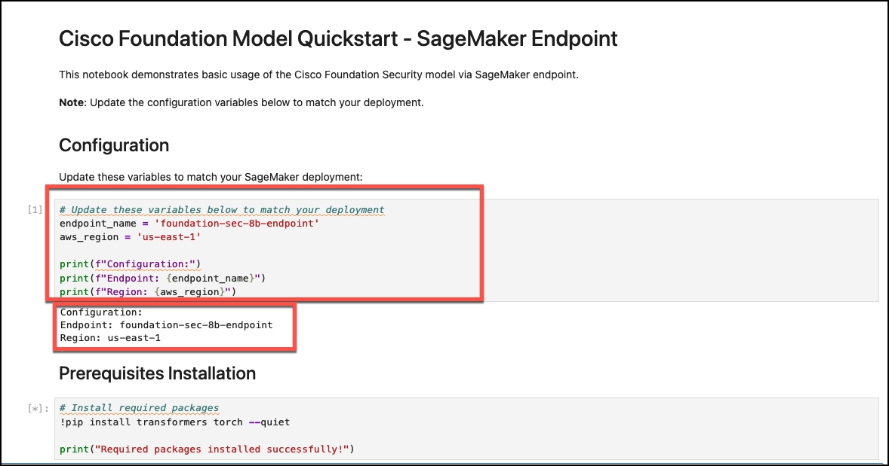

# Sagemaker AI Playground

## Overview

Welcome to the SageMaker AI Playground! 🤖 This repository provides a Terraform-based lab environment designed to deploy a robust AI research environment on AWS using **SageMaker AI** MLOps managed services. It separates the model hosting from the development environment for better production scalability and cost management.

This project was created to provide a ready-to-use "playground" for running generative AI workloads, specifically for cybersecurity research, with minimal manual setup. It deploys two core, decoupled resources:

1. **A SageMaker Model Endpoint:** A dedicated, GPU-accelerated (ml.g5.2xlarge) environment for hosting a large language model. It uses the Hugging Face TGI (Text Generation Inference) container to serve the model efficiently.

2. **A SageMaker Notebook Instance:** A cost-effective CPU instance (ml.t3.medium) that serves as your development environment. It comes pre-loaded with sample Jupyter notebooks that are automatically configured to interact with the model sagemaker endpoint.

The environment automatically deploys Cisco's Foundation-Sec-8B-Instruct, an open-weight, 8-billion parameter instruction-tuned language model specialized for cybersecurity applications.

## Key Features

* Managed GPU Inference: Deploys a powerful SageMaker Endpoint on a ml.g5.2xlarge instance, optimized for hosting LLMs without the need to manage servers, Docker, or NVIDIA drivers.  This resource is created via ```model_endpoint_instance.tf```.

* Hugging Face TGI Container: Uses the official Hugging Face Text Generation Inference container for high-performance, production-ready model serving.

* Pre-configured Notebook Environment: Launches a SageMaker Notebook instance that automatically clones a repository of cybersecurity use-case notebooks and configures them to use the deployed model endpoint.  The Sagemaker Jupyter notebook is created via ```notebook_instance.tf```.

* Scalable Architecture: By separating the notebook from the inference endpoint, you can stop the notebook to save costs while keeping the model available, or scale them independently.  You can also use the model endpoint with other applications instead of the Jupyter Notebook.  A sample python script (inference_query1.py) to run inference against the endpoint is included that uses Boto3 sagemaker client.

* Ready-to-Use Cyber Security Model: Automatically deploys the ```fdtn-ai/Foundation-Sec-8B-Instruct``` model from Hugging Face.  This represents your own private LLM model hosting and inference endpoint for Cyber Security use cases.


## Estimated Cost
**Disclaimer:** Deploying this playground will incur AWS charges. The costs are primarily driven by the SageMaker Endpoint and Notebook instances. You are billed for the time they are in the InService state.

This playground uses the following SageMaker instances by default. These can be customized in the Terraform files.

| Resource | Instance Type | vCPU | Memory (GiB) | GPU Memory (GiB) | Hourly Cost (us-east-1) |
| :------- | :------: | -------: | -------: | -------: | -------: | 
| SageMaker Endpoint | ml.g5.2xlarge | 8 | 32 | 24 | $1.388 |
| SageMaker Notebook | ml.t3.medium | 2 | 4 | NA | $.058 |

**Note:** Always check the [AWS SageMaker Pricing page](https://aws.amazon.com/sagemaker/pricing/) to confirm the latest pricing in your region. The ```ml.g5.2xlarge``` instance is the recommended minimum for hosting the 8-billion parameter Foundation model.

## How to Manage Costs 💰

* **Run only when needed.** Use terraform destroy to tear down all resources when you are finished.

* **Stop the Notebook Instance.** You can stop the SageMaker Notebook instance from the AWS Console to avoid charges for it while keeping the model endpoint running.

* **Monitor your billing dashboard.** Use the AWS Cost Explorer to track your spending in near-real-time.

## Requirements and Setup

You will need a Hugging Face account https://huggingface.co/.  Generate a free Hugging Face API / access token.  

**Tested with:**

* Mac OS 13.4 or Ubuntu 22.04
* terraform 1.5.7

**Clone this repository:**
```
git clone https://github.com/iknowjason/sagemaker-ai-playground
cd sagemaker-ai-playground
```

**Credentials Setup:**

Generate an IAM programmatic access key that has permissions to build resources in your AWS account.  Setup your .env to load these environment variables.  You can also use the direnv tool to hook into your shell and populate the .envrc.  Should look something like this in your .env or .envrc:

```
export AWS_ACCESS_KEY_ID="VALUE"
export AWS_SECRET_ACCESS_KEY="VALUE"
```

## Hugging Face Setup ##
The Cisco Foundation Model requires you to accept a user agreement and use a Hugging Face token for access.
1. Go to the [Foundation-Sec-8B-Instruct](https://huggingface.co/fdtn-ai/Foundation-Sec-8B-Instruct) model card and accept the terms.
2. Set up an account on https://huggingface.co.  Generate a Hugging Face User Access Token with read permissions from your Hugging Face settings page.
3. Set the token as an environment variable so Terraform can access it:
```
export TF_VAR_hf_token="YOUR_HUGGING_FACE_TOKEN"
```
Or you can add it to the default parameter under the ```model_endpoint_instance.tf``` file just right here:
```
variable "hf_token" {
  description = "Hugging Face API token with access to the Cisco Foundation Model"
  type        = string
  sensitive   = true
  default     = "ADD_YOUR_TOKEN_STRING_HERE"
}
```
The Hugging Face access token is used on the Sagemaker container with Text Generation Inference (TGI) to load the model.  You can read more about TGI [here](https://huggingface.co/docs/text-generation-inference/en/index).

### Run terraform init
Change into the ```sagemaker-ai-playground``` working directory and type:

```
terraform init
```

### Run terraform plan or apply
```
terraform apply -auto-approve
```
or
```
terraform plan -out=run.plan
terraform apply run.plan
```

### Destroy resources
```
terraform destroy -auto-approve
```

### View terraform created resources
The lab has been created with important terraform outputs showing services, endpoints, IP addresses, and credentials.  To view them:
```
terraform output
```

# Details and Usage

The primary way to interact with your AI playground is through the SageMaker Jupyter Notebook.

1. Run terraform output to get the ```notebook_instance_url```.  You will see the following example output below.  Just grab the ```notebook_instance_url``` from the output:
```
notebook_instance_name = "cisco-foundation-cookbook-r267j"
notebook_instance_url = "https://cisco-foundation-cookbook-r267j.notebook.us-east-1.sagemaker.aws/tree"
sagemaker_endpoint_name = "foundation-sec-8b-endpoint"
sagemaker_endpoint_url = "https://runtime.sagemaker.us-east-1.amazonaws.com/endpoints/foundation-sec-8b-endpoint/invocations"
```
2. Open this URL in your browser. This will take you to the JupyterLab interface running on your notebook instance.

3. Inside the file browser, you will see a folder named cisco-foundation-notebooks. This contains the pre-loaded examples ready for you to run.

## Monitoring the Deployment

* **SageMaker Endpoint:** You can monitor the status of the model endpoint creation in the AWS Console under SageMaker > Inference > Endpoints. Wait for the status to change to InService.

* **Notebook Instance:** The notebook instance runs a startup script. You can view the logs for this script in CloudWatch Logs under the log group ```/aws/sagemaker/NotebookInstances``` to ensure the sample repository was cloned correctly.  Look for a log stream ending with the name ```LifecycleConfigOnCreate```.  This should correlate with the commands in your jupyter notebook creation, under the ```notebook_instance.tf``` file, under ```on_create```.

## Testing the Inference Endpoint
The playground provides two main ways to test your model endpoint:

1. Using the Pre-loaded Jupyter Notebooks

The notebook instance has an **on_create** setup that downloads from the following repository containing some security notebooks built for Cisco's foundation-sec-8b-instruct model:  
https://github.com/iknowjason/cisco-foundation-notebooks

You can adapt and change the setup of this compute notebook instance or change the repository automatically downloaded.  See this [line](https://github.com/iknowjason/sagemaker-ai-playground/blob/main/notebook_instance.tf#L49) for reference.

These notebooks were modified from the original work done by Cisco researchers [1] to support using the Sagemaker client runtime to run inference against the hosted endpoint.  All of this created with terraform.  This separation of notebook R&D from model hosting + endpoint makes it easier to scale and experiment with separate solutions.

[1] https://github.com/cisco-foundation-ai/cookbook

This is the easiest method. Simply open one of the notebooks. They are already configured with the correct endpoint name and use the boto3 SDK to send inference requests.  Below are some screens showing a quick tutorial of these steps.

Grab the ```notebook_instance_url``` from the output of terraform.  It will look similar to this line (as an example):
```
notebook_instance_url = "https://cisco-foundation-cookbook-r267j.notebook.us-east-1.sagemaker.aws/tree"
```

Click on the ```cisco-foundation-notebooks``` directory as shown below.


You will see several of the nice notebooks created by Cisco researchers for demonstrating Cybersecurity use cases with the Foundation-sec-8b-instruct model.  Click on the ```quickstart_instruct.ipynb``` notebook.


Select the default ```conda_python3``` kernel as delineated below.


Click on the first cell under **Configuration** and run the code.  It should show the output as shown in the image below.  If this is your first time running Jupyter notebooks: In a Jupyter Notebook, the ```run code cell``` button is typically represented by a play icon (►).



Run the next cell for the **Prerequisites Installation** by just clicking on the play icon again.  This might take some time.  It will show an * (Asterisk) while running and then show a number when complete.  You should see the output as shown below with ```Required packages installed successfully!```.


Run the next code cell to initialize the sagemaker client.  It should show a successfull connection to your model hosting and inference endpoint that was managed by terraform in ```model_endpoint_instance.tf```.  You should be able to see the power, efficiency, and scalability of separating this development notebook from the actual model hosting and inference resources.  


Run the next code cell for a sample invoking of the endpoint with an prompt input related to Cyber Security.  Now you can see the inference() function called that is invoking your SageMaker endpoint.  You can use the boto3 client or even adapt code to an OpenAI API compatible curl request for private LLM inference.


Nice work!  Now you are setup for success.  Go back to the main directory and select one of the other Jupyter notebooks.  Since you have installed the pre-requisites, you can now run any of the Cyber Security use cases developed by [Cisco Reseachers](https://github.com/cisco-foundation-ai/cookbook).

2. Using the Sample Python Script

A sample script, ```test_inference.py```, is included in this repository to show how you can invoke the endpoint from any machine with AWS credentials for your account.  While authenticated with your AWS account, simply run the script:
```
python3 inference_query1.py
```
You should see similar output of the following:


# License
This project is licensed under the MIT License, which allows for reuse and modification with attribution. See the LICENSE file for details. All included third-party tools and libraries maintain their respective licenses. Enjoy your AI playground responsibly!

